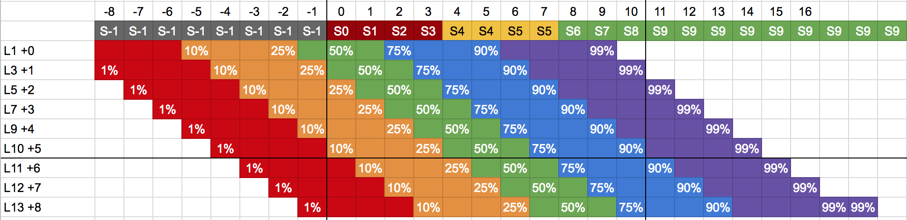

# Low Visibility
This is a mod for the [HBS BattleTech](http://battletechgame.com/) game that introduces a new layer of depth into the detection mechanics of the game. These changes are influenced by the double-blind rules from MaxTech, but have been heavily adapted to the video game mechanics.

This mod has been designed to work with [RogueTech](http://roguetech.org). In theory is should work without that mod, but your mileage may vary.

__WARNING: THIS MOD LIKELY BREAKS SKIRMISH MULTIPLAYER.__ It has not been tested, but all due to the way it's been implemented my guess is that it won't work. You have been warned!

## Summary

This mod is comprehensive, but a short summary of changes in the mod include:

* Sensor blips can now be targeted and attacked, allowing long range builds to be more viable.
* ECM bubbles provide protection for allies and reduce enemy sensors.
* Enemy details are hidden and are only revealed to strong sensors and/or pilots with high Tactics.
* The environment can reduce visibility due to snow, rain, night, etc. This makes sensors critical to success on those maps.
* Stealth can hide enemy mechs (and your own!) allowing you to close range safely.

## Target Detection

What you can detect is defined by your unit's _visual lock_ or _sensor lock_. __Visual Lock__ occurs when your unit can visually identify a target, while __Sensor Lock__ occurs when your unit can identify a target using electronics. A unit can have one, both or no lock to a target, depending on various factors (described below).

### Visual Locks
Visual Locks offer the least information, providing little more than the target chassis and it's location. At long ranges all you will be able to say is that a target is an Atlas, Catapult, or Missile Carrier but you won't be able to tell which variant it is, or what it's carrying. At close range (typically within 5 hexes or so) the pilot can approximate some values such as armor and weapon types, but these are best guesses and can't always be trusted.

Information from visual locks is shared between all friendly units. The player and allied units share visual locks, while neutral and enemy units only share visual locks between their 'faction'.

### Sensor Locks
_Sensor Locks_ offer more information at a further distance. Experienced pilots and advanced equipment can use their sensors to identify fine details of a target. Some examples include exact armor values, component locations and possibly even the pilot name.

Sensor locks only share the location and outline of a target with their allies. Each unit has to rely upon their own sensors for the detailed breakdown of weapons, armor and equipment on the target. Specialized equipment can bypass this restriction and allow allied units to share detailed information as well as general location data.

#### Sensor Lock Checks
_Sensor Locks_ aren't reliable; they depend on the pilot's ability to interpret results amidst a changing electronic battlefield. At the start of each round, every unit makes a _sensor range_ and _sensor detail_ check.

 The __sensor range__ check influences how far out the unit can detect targets. A good roll increases the range, while a poor roll reduces it. The check result acts as a multiplier to the __total__ sensor range of the model, after any component multipliers or additions are included.

 The __sensor detail__ check influences what information you are presented on the target when you select them. If the roll is failed, you're unable to determine any specifics of the target and have to shoot blindly at them. Successes will reveal information such as their actual weapon loadout and armor status.

 The results of your current check are displayed in a tooltip in the status bar of each player mech. Check the icons in the bottom right corner, over the armor paperdoll, for a detailed breakdown.

### EW Equipment
__ECM__ components generate interference in a bubble around the unit, which makes the _sensor check_ of enemy units within that bubble more difficult. Units within the range of a friendly ECM are harder to detect as well. Powerful ECM can completely shutdown a unit's sensors, forcing them to rely upon visual lock for targeting purposes.

__Stealth__ components makes the equipped unit harder to detect. They require an ECM component to operate, but disable the ECM bubble effects.

__Active Probe__ components improve the quality of the units' sensors, and can break through ECM and Stealth if they are powerful enough.

__Narc Beacon__ weapons attach a powerful transmitter to targets. For a short duration, they will emit a signal that friendly units can use to identify the target's location __at any range__. This signal is opposed by friendly ECM, and may be disabled if enough ECM is present to overcome it's signal.

__TAG__ weapons identify the location and details of the target for all friendly units that receive the signal. This effect persists until the unit moves away from the position it was identified. Friendly ECM has no impact on this signal.

## Implementation Details
This section contains describes how to customize the mod's behavior. The values below impact various mechanics used through the mod to control visibility and detection.

While not necessary, it's suggested that you are familiar with the information in the [Low Visibility Design Doc](DesignDoc.md).

### Visual Detection

The range of visual detection in _LowVisibility_ is typically much less than vanilla. Because sensor locks allow targeting and attacks, visual ranges have been reduced. Hopefully this provides a verisimilitude of an environment where both are necessary to survival.

No matter the circumstances, vision range cannot drop below a number of hexes equal to _VisionRangeMinimum_. This value can be edited in `LowVisibility/mod.json` and defaults to 2 hexes.

#### Visual Identification

In _LowVisibility_ many opponent details are hidden to simulate the uncertainty pilots would experience on the BattleTech battlefield.
Sensors are the best way to gain detailed information on your opponent (see the [Sensor Info](#Sensor-Info) section below), but the Mk.1 eyeball can be useful as well.

If a unit has visual lock to a target and is within a short distance, they can approximate many target details. Units within _VisualIDRange_ (which defaults to 5 hexes) will treat any opponent unit as if they have __Surface Analysis__.

#### Environmental Modifiers

_Visual Lock_ is heavily influenced by the environment of the map. Each map contains one or more _mood_ tags that influence the vision range on that map. When each map is loaded, a base vision range is calculated for every unit from these tags. Flags related to the ambient light the a base vision range, while flags related to obscurement provide a multiplier that reduces this range.

Base Vision Range | Light |  Tags
-- | -- | --
15 hexes (450m) | bright | mood_timeMorning, mood_timeNoon, mood_timeAfternoon, mood_timeDay
11 hexes (330m) | dim | mood_timeSunrise, mood_timeSunset, mood_timeTwilight
7 hexes (210m) | dark | mood_timeNight

Vision Multiplier | Tags
-- | --
x0.7 | mood_weatherRain, mood_weatherSnow
x0.5 | mood_fogLight
x0.3 | mood_fogHeavy

A map with _dim light_ and _rain_ has a vision range of `11 hexes * 30.0m * 0.7 = 231m`. Any _SpottingVisibilityMultiplier_ or _SpottingVisibilityAbsolute_ modifiers on the unit increase this base range as normal.

### Sensor Detection

At the start of every combat round, every unit (player or AI) makes two __sensor checks__. Each check is a random value between -14 to +14, assigned as per a normal distribution (aka a bell curve). The distribution uses mu=-2 and a sigma=4 value, resulting in a wide curve that's centered at the -2 result.



Each check is further modified by the source unit's tactics skill, as per the table below. (Skills 11-13 are for [RogueTech](http://roguetech.org) elite units).

| Skill |  1  |  2  |  3  |  4  |  5  |  6  |  7  |  8  |  9  |  10  | 11 | 12 | 13 |
| -- | -- | -- | -- | -- | -- | -- | -- | -- | -- | -- | -- | -- | -- |
| Modifier | +0 | +1 | +1 | +2 | +2 | +3 | +3 | +4 | +4 | +5 | +6 | +7 | +8 |
| w/ Lvl 5 Ability | +0 | +1 | +1 | +2 | +3 | +4 | +4 | +5 | +5 | +6 | +7 | +8 | +9 |
| w/ Lvl 8 Ability | +0 | +1 | +1 | +2 | +4 | +5 | +5 | +6 | +6 | +7 | +8 | +9 | +10 |

#### Sensor Range

The first check (the __range check__) is used to determine the unit's sensor range this turn. Each unit has a base sensor range determined by its type, as given in the table below. This range is increased by _SensorDistanceMultiplier_ and _SensorDistanceAbsolute_ values normally, allowing variation in unit sensor ranges.

| Type | Base Sensor Range |
| -- | -- |
| Mech | 12 hexes * 30m = __360m__ |
| Vehicle | 9 hexes * 30m = __270m__ |
| Turret | 15 hexes * 30m = __450m__ |
| Others | 6 hexes * 30m = __180m__ |

The range check result is divided by ten, then used as a multiplier against the unit's sensor range. A range check result of +3 yields a  sensor range multiplier of (1 + 3/10) = 1.3x. A negative range check of -2 would result in a multiplier of (1.0 - 2/10) = 0.8x.

No matter the circumstances, sensors range cannot drop below a number of hexes equal to _SensorRangeMinimum_. This value can be edited in `LowVisibility/mod.json` and defaults to 6 hexes.

##### Target Signature

A unit's sensors define the range at which they can see a standard target in normal conditions. Equipment and environment can result in a target that's easier or harder to see, which is expressed through their __signature__ rating. This rating is typically hidden, though components in the Mechlab will indicate any increases or reductions in signature.

Target signatures act as a multiplier to the sensor range. If a unit has a sensor range check that resulted in sensors range 400:

  * A hard to detect target with signature 0.5 would only be detectable at 200m or closer.
  * A standard target with signature 1.0 would be detectable at 400m or closer.
  * An easy to detect target with signature 1.2 would be detectable at 480m.

__EVEN IF A TARGET IS WITHIN YOUR SENSOR RANGE AND YOU HAVE A GOOD CHECK, IT DOES NOT GUARANTEE YOU CAN DETECT THEM.__ Their signature can reduce your effective range without you ever knowing.

Players should note that forests provide a 0.8 signature, while water applies a 1.2.

#### Sensor Info

The second check (the __info check__) determines how much target information the unit will receive this round. This check is applicable for optimal conditions - enemy ECM and other effects can reduce this value on a target by target basis. The range of check results is given below:

| Info Check | Detail Level | Details shown |
| --| -- | -- |
| < 0 | No Info | Failed sensor check, no information shown |
| 0 | Location | Target location (3d arrow), but unknown name |
| 1 | Type | As above, but type defined (mech/vehicle/turret) |
| 2 | Silhouette | As above, with Chassis as name (Atlas, Catapult) |
| 3 | Vector | As above, adding Evasion Pips |
| 4 or 5 | Surface Scan | As above, adding Armor & Structure percentages, paperdoll |
| 6 or 7 | Surface Analysis   | As above, adding Weapon Types (as colored ???) |
| 8 | Weapon Analysis | As above, with Weapon Names defined. Name is Chassis + Model (Atlas AS7-D, CPLT-C1) |
| 9 | Structure Analysis | As above, plus current heat & stability, summary info (tonnage, jump jets, etc). Armor & structure includes current and max values. Name is Chassis + Variant name (Atlas ASS-HAT Foo, Catapult CPLT-C1 Bar) |
| 10 | Deep Scan | As above plus component location, buffs and debuffs |
| 11 | Dental Records | As above plus pilot name, info |

### First Turn Protection

On the very first turn of every combat, every unit (friendly, neutral, or foe) always fail their __range check__. This ensures players can move away from their deployment zone before the AI has a chance to attack them. This behavior can be disabled by setting `FirstTurnForceFailedChecks` to __false__ in `mod.json`.

## Components
The sections below define behaviors exposed through components, such as equipment and weapons.

### ECM

ECM components emit a bubble around the unit. After every movement occurs, all units are checked to see if they are within the ECM bubble of another unit.

If they are within an enemy ECM bubble, they gain an __ECM jamming__ modifier equal to the strength of the emitter. This reduces __both__ _Detection_ checks by the emitter strength.

If the unit is within a friendly ECM bubble it gains __ECM protection__. This adds the friendly emitter's strength as a negative modifier to any _Detection Info_ checks made against the target.

If there are multiple ECM emitters covering a target, the strongest modifier will be applied. Each additional emitter will add +1 strength to the strongest emitter's modifier. This value can be tweaked by changing the ``MultipleJammerPenalty`` in ``mod.json``.

ECM components must have the tag ```lv-jammer_mX_rY``` to be recognized as an ECM emitter. The X value is the modifier the emitter adds as protection or jamming to the target. The Y value is the size of the ECM bubble generated, in hexes. A tag of __lv-jammer_m4_r8__ would apply to any targets within 8 hexes, apply a modifier of -4 to jammed enemies, and add 4 points of protection to friendly units.

If an enemy unit within an ECM bubble is attempting to detect a friendly unit protected by the bubble, __both modifiers apply__. If there are two overlapping bubbles of __lv-jammer_m4_r8__ emitters, the enemy would have a total `-4 -1 = -5` penalty from being __jammed__, and a further `-4 -1 = -5` modifier due to the target having __protection__. Their checks would have a __-10__ modifier to detect the unit protected by both bubbles.

### Active Probes

Some components apply a modifier to the unit's _Sensors Range Check_ and _Sensors Info Check_. These generally add a bonus that increases sensors range, and improves resolution of target details.

* Components with a `lv-probe_mX` apply the highest value of X as a modifier to the unit's sensor checks. Only the best value is applied, and negative values are ignored.
* Components with a `lv-probe-boost_mX` tag sum their X values, and apply the result as a modifier to sensor checks. Negative values for X are allowed.

The modifiers from the `lv-probe_mX` and `lv-probe-boost_mX` tags are additive. If a unit has both, their sensors are improved by the sum of each modifier.

> Example: A unit has components with tags lv-probe_m2, lv-probe_m3, lv-probe-boost_m2, lv-probe-boost_m. The sensor check modifier is 3 (from lv-probe_m3, which causes lv-probe_m2 to be ignored), + 2 (lv-probe-boost_m2) + 1 (lv-probe-boost_m1) = 6. This unit would add +6 to any sensor range and info checks it makes.

To build __Active Probes__, you should use the `lv-probe_mX` modifier to ensure only the strongest probe is used. `lv-probe-boost_mX` can be used to build equipment that reduces sensors, reflecting poor equipment.

These modifiers apply to both range and info. If you only want longer ranged sensors, use the `SensorRangeMultiplier` and `SensorDistanceAbsolute` on the component instead.

### Stealth

Stealth components reduce an opponent's ability to sensor lock the protected unit. Stealth only applied to the unit directly, and has no effect when the enemy attempts to detect other friendly units. Stealth generally applies a penalty to the opponent's check, which reduces the _Sensors Info Check_. Stealth does not impact an opponent's _Sensors Range Check_.

* Components with a `lv-stealth_mX` apply the highest value of X to the unit's stealth modifier. Only the best value is applied, and negative values are ignored.
* Components with a `lv-scrambler_mX` tag sum their X values, and apply the result to the unit's stealth modifier. Negative values for X are allowed.

The modifiers from the `lv-stealth_mX` and `lv-scrambler_mX` tags are additive. If a unit has both, their sensors are improved by the sum of each modifier.

> Example: A unit has components with tags lv-stealth_m2, lv-scrambler_m-2, lv-scrambler_m-3. The stealth modifier is 2 (from lv-stealth_m2), - 2 (lv-scrambler_m-2) - 3 (lv-scrambler_m-3) = -3. This unit would add +3 to any sensor range and info checks against it, because it's stealth modifier is negative.

__Design Note:__  Stealth closely approximates the sensor and signature spectrum HBS already has in the game. _LowVisibility's_ stealth was created to be less binary than signature reductions. Signature modifiers also hide a target, by reducing the range at which the target can be detected. Sensor modifiers can increase the range, allowing a push and pull between them that mimics TT stealth. However, Stealth reduces the info level (not the range), which allows high-sensor builds to still have a chance to detect them for targeting purposes, without knowing their details.

## Effects

The sections below discuss electronic warfare effects allowed by  _LowVisibility_.

### Narc Effect

Narc beacons launch a small transmitter that attaches to the target and broadcasts their location. _LowVisibility_ provides an effect tag that mimics this effect by providing a strong bonus to sensor detect checks for targets that have been narc'd.

Any effect that attaches the `lv-narc-effect_mX` tag will apply X as a modifier to sensor checks against the unit under the effect. If this modifier is greater than the affected unit's ECM protection the unit will be marked as a sensor blip regardless of sensor range. Units within sensor range will apply the difference as a modifier to any _sensor info checks_.

> Example: A unit has a `lv-narc-effect_m6` applied to it from a Narc beacon. The unit has ECM protection of 4, so the Narc's effect becomes 6 -4 = 2. The unit's will be visible as a blip at any range, and ay sensor info checks against the unit gain a +2.

An example of attaching this tag to an effect is below:

```
"statusEffects": [{
    ...
    "tagData" : {
    "tagList" : [ "lv-narc-effect_m8" ]
  },
}]
```

### TAG Effect

TAG emitters are special sensors that provide deep information on a target so long as they can be targeted with a laser-like beam. _LowVisibility_ mimics this effect by providing a _sensor info modifier_ that decays as the target moves. TAG effects are NOT impacted by ECM protection, which provides a way for players to fight against opponents with strong ECM.

Any effect that incorporates the `lv-tag-effect` provides a _sensor check_ equal to the duration of the effect. Any friendly unit applies this bonus to their _sensor info check_. This effect is intended to be placed on a status effect with durationData that uses `ticksOnMovements: true`. `ticksOnMovements` causes the effect duration to be reduced by one for each hex the unit moves, which provides the decay effect we expect.

> Example: A unit has an effect with the `lv-tag-effect` applied to it, with an effect duration of 10. Sensor info checks against the target would gain a bonus of +10. If the target moves 4 hexes, the duration would reduce to 6, which also reduces the sensor info check bonus to +6. Once the target moved another 6 hexes the bonus would completely decay.

An example effect that uses this tag is below:

```
"statusEffects": [{
"durationData":{
    "duration" : 10,
    "ticksOnActivations" : false,
    "useActivationsOfTarget" : true,
    "ticksOnEndOfRound" : false,
    "ticksOnMovements" : true,
    "stackLimit" : 1,
    "clearedWhenAttacked" : false
	},
"targetingData" : {
    "effectTriggerType" : "OnHit",
    "triggerLimit" : 0,
    "extendDurationOnTrigger" : 0,
    "specialRules" : "NotSet",
    "effectTargetType" : "NotSet",
    "range" : 0,
    "forcePathRebuild" : false,
    "forceVisRebuild" : false,
    "showInTargetPreview" : false,
    "showInStatusPanel" : true
    },
"effectType" : "TagEffect",
"Description" : {
    "Id" : "TAG-Effect-Vision",
    "Name" : "TAG'd - Visibility",
    "Details" : "This will be much easier to sensor lock until it moves.",
    "Icon" : "uixSvgIcon_artillery"
},
"nature" : "Debuff",
"statisticData" : null,
"tagData" : {
	"tagList" : [ "lv-tag-effect" ]
	},
"floatieData" : null,
"actorBurningData" : null,
"vfxData" : null,
"instantModData" : null,
"poorlyMaintainedEffectData" : null
}]
```

## Attack Modifiers
Once a target has been detected it can be attacked normally, though attacks may suffer penalties based upon how strong of a lock they have to the target.

If an attacker only has _sensor lock_ to the target, they suffer a __Sensors Only__ attack penalty of +2 (_SensorsOnlyPenalty_).

If an attacker only has _visual lock_ to the target, they suffer a __Vision Only__ attack penalty based upon their distance to the target. For every 3 hexes away (_VisionOnlyRangeStep_) the attacker suffers a +1 attack penalty (_VisionOnlyPenalty_), regardless of the weapon used.

These penalties described can be adjusted by editing `LowVisibility/mod.json`.

### Zoom Vision

BattleTech has a long standing tradition of zoom vision being a standard feature on cockpits. To support this, components with the `lv-vismode-zoom_mX_sY` tag apply an attack bonus that decays over distance. Each point of X applies as a -1 bonus to the attack roll. For each Y hexes between the attacker and the target, the bonus is reduced by one, until no bonus is provided.

> Example: A unit has a component with tag `lv-vismode-zoom_m3_s8`. For any **ranged** attack between 0-8 hexes, the attacker applies a -3 attack bonus. For attacks between 9-16 hexes, the attacker applies a -2 bonus. At 17-24 hexes the bonus is -1, and at 25+ hexes there is no bonus.

This bonus only applies ranged attacks. This bonus does not stack with other vision bonuses. An attacker with multiple vismode components applies the highest bonus to an attack, plus +1 for each addition vismode that provides a bonus.


### Heat Vision

Like zoom vision, detecting an opponent through thermal vision has been a stable of BattleTech games back to MW2. Components with the `lv-vismode-heat_mX_dY` mimic this effect by applying an attack bonus that increases the as the target heats up. The attacker gains a -X bonus to their attack for each Y points of heat the target currently has. This bonus cannot exceed _HeatVisionMaxBonus_, defined in `LowVisibility/mod.json`.

> Example: A unit has a component with tag `lv-vismode-heat_m1_d20`. For any **ranged** attack where the target has 20 heat or less, the attack gains no bonus. If the target has 20-40 heat the attack has a -1 bonus, for 41-60 heat it has a -2 bonus, and so on.

This bonus only applies ranged attacks. This bonus does not stack with other vision bonuses. An attacker with multiple vismode components applies the highest bonus to an attack, plus +1 for each addition vismode that provides a bonus.

### Stealth Attack Modifiers

In addition to making sensor detection difficult, stealth can make it hard to attack a target at range. To reflect that _LowVisibility_ exposes a few tags that add special case modifiers to the attack roll.

* Components with the `lv-stealth-range-mod_sA_mB_lC_eD` apply a penalty to an attacker's weapons based upon their range to the target. A penalty of A is applied against targets at short range, B at medium range, C at long range, and D at extreme range.
* Components with the `lv-stealth-move-mod_mX_sZ` tag apply a penalty that is strongest when the target doesn't move. X is the base penalty that applies to any attack against the target. This penalty decays by 1 for each Z hexes the target moves, until it the penalty is completely eliminated.

> Example One: A tag of `lv-stealth-range-mod_s1_m2_l3_e4` would apply a +1 penalty at short range, +2 at medium range, +3 at long range and +4 at extreme range. This range is applied per weapon, so the attacker may experience different penalties for different weapons they fire.

> Example Two: A tag of `lv-stealth-move-mod_m3_s2` applies a +3 penalty to the attacker if the target does not move. If the target moves 1 or 2 hexes, this penalty would be reduced (by -1) to +2. If the target moves 3-4 hexes, the penalty is reduced to +1, and if the unit moves 5 hexes or more the penalty is completely removed.

## WIP Features
- [x] BUG: Ranges should be normalized to a hex instead of partial hex (Math.Ceil to hex definition)
- [] FEATURE: Change first turn protection to evasion
- [] FEATURE: Change vismode-zoom to be an increasing modifier that caps at a specific value
- [] BUG: Major performance hit on assault base missions; takes 2-3 seconds per move. Investigate why this is.
- [x] BUG: vismodes should only apply to ranged attacks
- [] BUG: Stability & heat bars showing on vehicles & turrets for some reason.
- [x] BUG: Ranges should be rounded up to nearest hex?
- [x] BUG: Enemies not following the sensor blackout on turn one; there are cases where they get to attack anyways.
- [] BUG: Evasion pips display in T.HUD but not on the GameRepresentation
- [] BUG: Debuff icons don't update when the sensor lock check is made, they only update after movement. Force an update somehow?
- [] BUG: Weapons summary shown when beyond sensors range with a high check.
- [] BUG: Units remain in vision even when units move away. Investigate why this occurs.
- [x] BUG: Have to select a unit after save for GameRepresentations to be rendered.
- [x] BUG: If you have sensor lock from a position, but not LOS, doesn't display the lines showing that you can shoot from there. How to fix? Looks to be related to AIM.
- [] BUG: Sensor range circle not updating onActorSelected; gives you a false sense of where you can see
- [] FEATURE: Per Denandan, move functions from tags into Custom {} to allow getting item defs w/o needing to search/parse
- [] FEATURE: Rename `lv-scrambler_mX` to `lv-stealth-boost_mX` to match probes.
- [] FEATURE: Rename active probes to `lv-sensormod-highest_mX` and `lv-sensormod-sum_mX`
- [] FEATURE: Show signature, visibility modifiers for target on the tooltips.
- [] Armor/structure exact values are being shown, not just as ??
- [] FEATURE: Make sensor lock not end your turn (SensorLockSequence)
- [] FEATURE: ImplementNoSensorLockCriticalMultiPenalty = 0.0f; NoVisualLockCriticalMultiPenalty = 0.0f; (Modify called shot critical, % when making a shot w/o lock)
- [] FEATURE: On shutdown, no stealth / ecm / etc applies
- [] FEATURE: Component damage should eliminate ECM, AP, Stealth bonuses
- [] FEATURE: ```lv_shared_spotter``` tag on pilots to share LOS
- [] FEATURE: Implement ```lv-mimetic_m``` which represents reduces visibility if you don't move
- [] FEATURE: Implement rings for vision lock range, ECM range, similar to what you have with sensor range (blue/white ring around unit)
- [] FEATURE: Implement stealth multi-target prohibition
- [] FEATURE: Reimplement sensor shadows?
- [] FEATURE: Add a ```lv-max-info``` tag that caps the level of info that can be returned for a given unit. This would support certain units like infantry that have been asked for.
- [] FEATURE: injuries reduce sensor check

### Possible Additions

- [] Add ability for a pilot to get a bad reading / critical failure. Tie to tactics as a roll, so poor pilots have it happen more often.  In failure, show wrong name/tonnage/information to confuse the player. May need some hidden marker indicating that this is a false lead - possibly a temporarily value that can be removed once we introduce the mod.
- [] Should stealth have a visibility modifier that changes as you move move? I.e. 0.1 visibility if you don't move, 0.5 if you do, etc. (Think Chameleon shield - should make it harder to see the less you move)
- [] Experiment with AllowRearArcSpotting:false in CombatGameConstants.json
- [] SensorLock becomes passive ability that doubles your tactics, boosts sensor detect level by +1 (for 'what you know'). Eliminate it as a menu item, ensure forceVisRebuild never gets called.
- [] Add a 'lv-dentist' tag that always provides the highest rating of info
- [] Add a 'lv-ninja' tag that always hides all the information of a unit.
- [] Add a 'lv-vision-lowlight_rX' for low-light vision; increases visual range during a non-daylight mood
- [] Add a 'lv-sensor-heat_rX_hY' for heat vision; increases detection of units with high heat ratings. For every Y heat, add +1 to the sensor check for this unit.

### To Document
- [x] FEATURE: Add `lv-vision-heat_m` modifiers; reduces direct fire penalty, but at different ranges
- [x] BUG: SensorRange not respecting SensorRangeMinimum.
- [x] BUG: stealth_move_mod is unbounded, can result in a +81 bonuses
- [x] BUG: Narc, Tag not cleaned up on combat end. Causes some NPEs.
- [x] BUG: VisibilityRange not respecting VisionRangeminiumum
- [x] BUG - When you overheat a mech, it disappears from vision
- [x] VisionLock and VisualID ranges should be modified by equipment.
- [x] Fix issues with VisualID - make it apply if close enough
- [x] Hide pilot details when not DentalRecords
